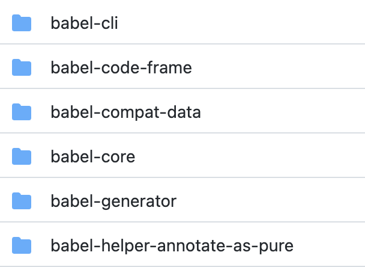
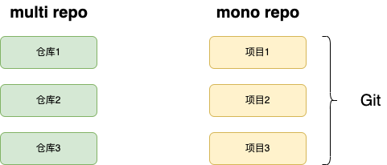
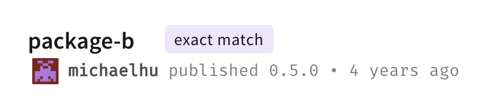

# MonoRepo

monoRepo 其实就是将多个项目整合到一个 git 项目中进行管理的一种方式。应该大家都有用过或者见过这种代码管理方式，可能不清楚这个名词而已。很多知名开源项目都采用了这种方式，比如 babel、vue3 等等。



与 monoRepo 相对应的就是将多个项目分开在不同的代码仓库中进行管理，即 multiRepo。两者的关系可以见下图。monoRepo 也被称作 `multi-package repositories`，注意和 `multiRepo` 区分开 🧐。



我们先来看看 monoRepo 能为我们解决哪些便利，以及我们为什么需要 monoRepo？

## monoRepo 的优势

### 方便管理

在新人入职公司之后，不出意外的话，第一天应该都是在开通各种 Git 仓库的权限，把项目代码一个个 clone 下来，然后需要在每个项目安装依赖，最后才能将代码跑起来。

如果采用 monoRepo 的管理方式的话，这个过程将会变得简单不少。因为代码全部都集中在一个仓库中进行管理，所以我们只需要 clone 一个 Git 仓库，很便捷的就可以将依赖安装好，并启动任意项目。虽然安装依赖过程需要的时间比安装单个项目依赖要长，但由于 monoRepo 能够将项目下的依赖按照一定的规则进行提升，所以 node_modules 的体积肯定是要小于 multiRepo 的。

### 代码复用

身为一个有操守的程序员，大家肯定都有在遵循着 **DRY** (Don’t Repeat Yourself) 原则，即尽量的去实现代码复用。在单个项目中实现代码复用非常的简单，可以将需要复用的代码存放在单独的文件夹中，需要时从这里取即可。

如果是在不同的项目之间需要进行代码复用呢，当然我们也有办法，比如将复用逻辑提取为 npm 包，在需要的项目中引入这个包也能实现代码复用。

这个方式也有一些问题，比如在 npm 开发时，我们可能会使用 `npm link` 或者 `yarn link`的方式来开发。如果多人协作开发多个 npm 包，这个 link 的过程还是挺繁琐的，而且 link 安装的本地依赖不会在 `package.json` 体现出来，等包发布到 npm 时，需要再全部安装一遍。

在项目上线之后，如果有需求或者 bug 需要对 npm 包(称作 moduleA 吧)中的代码进行改动，你可能需要执行以下几步

1. moduleA 基于 master 迁出新的分支，进行开发
2. 在项目中用 link 的方式安装 moduleA
3. moduleA 开发完成并本地自测完成后，push 到测试分支
4. 项目也需要基于 master 迁出新的分支，更改 moduleA 的版本号，或者进行这个需求的其他代码开发，发布到测试分支
5. 测试环境测试没问题后，发布到正式环境之前需要先发布 moduleA

这一系列操作下来还是比较繁琐的，对公有 npm 包的管理也需要一定的成本。然而，如果你选用了 monoRepo，上面的问题应该都可以较好的解决。

在 monoRepo 中进行代码复用就跟在单个项目中一样的简单，同样将复用代码提取在单独的文件夹。在迭代开始时，可以基于一个 commit 提交本次更新的内容，也便于代码 review。

### 工程化统一

在 multi repo 的项目中，由于每个项目都是割裂的，所以每个项目都需要单独的 eslint、prettier 以及其他一些基础建设，这样的工作都是重复且简单的，如果要在每个项目中都保持规则、代码风格的统一，那么就需要在每个项目中 CV 这部分逻辑，(合法，但不提倡.jpg)。

## monoRepo 缺点

当然，monoRepo 也并非银弹，它也带了一些新的问题

- 如果项目太大，git 操作、安装依赖等会变得很慢
- monoRepo 将多个项目整合在了一起，所有项目都是对全体员工开放的，没有办法使用 Git 对项目做文件夹级别的权限控制。从另一方面来说，因为代码都是开放的，员工可能因此更加注重代码质量。

## workspaces

workspaces(工作区) 由 yarn 提出，用于简化 monoRepo 模式下本地依赖包的管理。在 workspaces 推出之前，我们需要手动 link ，当本地依赖太多时，这个过程就稍显繁琐了。在 npm7 之后，npm 也提供了对 worKspaces 的支持。以 npm workspaces 为例简单讲讲 workspaces 的使用

### npm workspaces

定义一个 workspaces 通常的做法是在根目录 `package.json` 中添加 `workspaces` 字段，并加上 `private` 防止误发布到 npm 上，毕竟项目文件夹下的其他项目才是我们真正的 npm 包，那么此时我们的 `package.json` 应该就是下面这样

```json
{
  "name": "npm-spaces",
  "version": "1.0.0",
  "private": true,
  "workspaces": ["packages/*"]
}
```

此时我们的 packages 文件夹就是一个工作区，我们在 packages 文件夹新建两个文件夹 package-a、package-b 即为两个独立的项目，每个文件夹下都建一个独立 package.json 文件，npm 也为我们提供了命令

```bash
npm init -w ./packages/package-c
```

该命令会自动会在 packages 文件夹下创建 package-c 文件夹，并在 package-c 文件夹下生成 package.json。

当我们需要在子项目中安装依赖时，可以使用

```bash
npm install lodash-es package-b -w package-a
```

上面的命令可以在 package-a 项目中安装 lodash-es 和 package-b，这个 package-b 仓库不会前往 npm 源上去查找，而是先寻找工作区内是否存在该项目，存在就直接安装工作区内的项目。

此时我们的项目应该是下面这个结构

```shell
├── node_modules
│    ├── lodash-es
│    ├── package-a
│    ├── package-b
│    └── package-c
│
├── packages
│    ├── package-a
│    │   └──  package.json
│    │
│    ├── package-b
│    │   └──  package.json
│    │
│    └── package-c
│        └── package.json
└── package.json
```

此时可以发现 node_modules 文件夹下存在我们自定义的三个 package 符号链接，指向 packages 文件夹下对应的文件夹。

### yarn workspaces

yarn workspaces 跟 npm 用法相似，假设我们已经有了 packages 文件夹，文件夹下有 `package-a`，`package-b`，`package-c`三个子文件夹，且都有自己的 `package.json`

我们使用 `yarn workspace` 命令来安装依赖

```shell
yarn workspace package-a add react package-b -S
```

即在 package-a 项目中，安装 react 和 package-b 包，点开 node_modules 一看，好家伙，package-b 安装的版本是 0.5，根本不是我们预想中的本地 package-b。

打开 npm 搜索 package-b，四年前就有人把 `package-b` 包上传到 npm 了(还有一个 `package-c` 也是他上传的 😑)。温馨提示，实践的时候可以搭建私有 npm 服务，将 demo 上传到公有仓库是不太优雅的。



如果需要安装本地的包，则需要指定 version 来精确匹配，然后我把本地 package-b version 改为 0.5.0（为了看匹配的是本地还是 npm 源）

```shell
yarn workspace package-a add package-b@0.5 -S
```

嗯，这回没有去 npm 源下载

但是这样肯定不行，为了避免安装非工作区包可能带来的风险， yarn V2 推出了 [workspace](https://yarnpkg.com/features/workspaces#workspace-ranges-workspace) 协议，使用 workspace 协议后，不再能够安装工作区之外的依赖，执行下面的安装命令

```shell
yarn workspace package-a add package-b -D
```

package-a 下的 `package.json`应该如下，除非你手动更改 package-b 的版本号为非 workspace 的安装方式，否则 package-b 将一直采用工作区中的版本。

```json
{
  "name": "package-a",
  "version": "1.0.0",
  "description": "",
  "main": "index.js",
  "devDependencies": {
    "package-b": "workspace:^"
  }
}
```

假设你某个项目 PackA 的 package.json 如下，且所有工作区项目的版本都为 1.5.0

```json
{
  "dependencies": {
    "star": "workspace:*",
    "caret": "workspace:^",
    "tilde": "workspace:~",
    "range": "workspace:^1.2.3",
    "path": "workspace:path/to/baz"
  }
}
```

在你发布 PackA 时，PackA 下的 package.json 将会根据 semver 规则进行转换成如下的形式

```json
{
  "dependencies": {
    "star": "1.5.0",
    "caret": "^1.5.0",
    "tilde": "~1.5.0",
    "range": "^1.2.3",
    "path": "1.5.0"
  }
}
```

## lerna

如果你了解过 monoRepo，那么你应该也听过 lerna，用 [lerna](https://lerna.js.org/) 官网中的话来概括 lerna

> Lerna is a tool that optimizes the workflow around managing multi-package repositories with git and npm.

lerna 的核心指令是 `lerna bootstrap` 和 `lerna publish`，前者处理依赖问题，后者解决发布问题，这里简单的介绍一下 lerna 的使用。

让我们先用 `lerna init` 新建一个 lerna 项目，并在 packages 文件夹下使用 `lerna create` 创建 `package-a`, `package-b` 和 `package-c` 三个子项目，在三个项目中都安装上依赖。

```shell
lerna add axios --scope package-a
```

这时候查看我们的文件夹，应该是下面的结构

```shell
├── packages
│    ├── package-a
│    │   ├──  node_modules
│    │   │    └── axios
│    │   └──  package.json
│    │
│    ├── package-b
│    │   ├──  node_modules
│    │   │    └──  axios
│    │   └──  package.json
│    │
│    └── package-b
│    │   ├──  node_modules
│    │   │    └──  axios
│        └── package.json
├── lerna.json
└── package.json
```

可以看到 lerna 在三个项目中都安装了 axios，显然是没有必要的。lerna 也提供了方法去处理依赖问题。

先用 `lerna clean` 去清除掉所有 package 下的 node_modules，然后用 `lerna bootstrap --hoist` 将所有依赖都提升至根目录。

通过上面 yarn workspace 我们知道 yarn 也是有依赖提升能力，且拥有比 lerna 更好的依赖分析和提升能力，而且 yarn 提供的安装更友好，不用先安装到 package 项目 下，再执行 `learn bootstrap --hoist` 到根目录下，实现无感知的依赖提升，lerna 自身也推荐使用 `yarn workspace` 来进行依赖管理。

所以一个较好的实践是使用 `yarn workspaces` 的方式来管理 lerna 下的依赖关系，在 `lerna.json` 中添加上下面字段且在 package.json 中添加 workspaces 字段即可使用 yarn 管理依赖

```json
{
  "npmClient": "yarn",
  "useWorkspaces": true
}
```

上面有提到 lerna 的两条核心指令是 bootstrap 和 publish，bootstrap 我们可以使用 yarn workspace 来提升依赖，且比 lerna 做的更好。publish 可就只有是 lerna 擅长的地方了。

来看一下执行 `lerna publish` 时做了哪些事

1. 找出上一个版本发布以来有变更的 package
2. 提示开发者确定版本号
3. 更新需要更新的 packages 的 version 字段
4. 创建新的 commit 提交到 git
5. 发布到 npm

也有一些 lerna 适用的生成 changelog 包，比如 [lerna-changelog](https://www.npmjs.com/package/lerna-changelog) 、[cz-lerna-changelog](https://www.npmjs.com/package/cz-lerna-changelog)等等。

## pnpm

尽管 lerna + yarn workspace 能够很好的解决 monoRepo 开发中的问题，目前的 monoRepo 项目也大都是基于 lerna + work workspace ，甚至一度被开发者认作 monoRepo 开发的最佳实践。但是 learn 在挺久以前就已经处于一个[无人维护](https://github.com/lerna/lerna/issues/2703)的状态。

于我而言，我是不大想去用无人维护的工具的，于是我又找到了 pnpm。

pnpm 相比于 npm 或者 yarn，它的用户量和知名度都不是很高，但它也凭借着一些优势，比如快速、节省空间的依赖安装、严格的依赖管理，以及优秀的 monoRepo 支持，得到了一部分人的喜爱。

前段时间，vue 完成了从 `yarn workspaces` 到 `pnpm workspaces` 的[迁移](https://github.com/vuejs/core/commit/61c5fbd3e35152f5f32e95bf04d3ee083414cecb)，可能在不久之后，vue 生态的都会完成向 pnpm 的迁移。

这篇主要从 workspace 的角度来看 pnpm 为我们带来的便利。关于从 lerna 到 pnpm 的迁移可以参考这篇[Replacing Lerna + Yarn with PNPM Workspaces](https://www.raulmelo.dev/blog/replacing-lerna-and-yarn-with-pnpm-workspaces)

你需要新增一个 `pnpm-workspace.yaml` 文件，

```yaml
prefer-workspace-packages: true
packages:
  - "packages/*"
```

packages 字段跟 package.json 中的 workspaces 字段作用一致。

如果需要在特定的 package 下安装依赖，可以执行

```shell
pnpm add package-a axios --filter package-b
```

上面的命令即在 package-b 中安装 package-a 和 axios，上面的 --filter 类似 lerna 的 --scope，关于两者的比较可以查看[pnpm vs Lerna: filtering in a multi-package repository](https://medium.com/pnpm/pnpm-vs-lerna-filtering-in-a-multi-package-repository-1f68bc644d6a)

此时 package-a 中的 package.json 应该是下面的样子。

```json
{
  "name": "package-a",
  "version": "1.0.0",
  "dependencies": {
    "axios": "^0.24.0",
    "package-b": "workspace:^1.0.0"
  }
}
```

可以看到 pnpm 也支持了 workspace 协议。

接下来我们建一个 demo 来简单走一下 pnpm workspaces 从开发到发布的过程。我们在 packages 文件夹见三个项目 package-a、package-b、package-c，就简称 PA、PB、PC 吧。其中前两个作为工具库，PC 作为业务项目。

我们在 PB 中，安装 `lodash-es`包，

```shell
pnpm add lodash-es --filter package-b
```

并在入口文件中暴露出一个函数

```js
// package-b
import { random } from "lodash-es";

export function randomNum(min, max) {
  return random(min, max);
}
```

顺带一提，在 pnpm 中的 npm 包中，还可以定义 publishConfig 来覆盖发布之后的 package.json 文件，举个栗子

```json
{
  "name": "foo",
  "version": "1.0.0",
  "main": "src/index.ts",
  "publishConfig": {
    "main": "dist/index.js",
    "typings": "dist/index.d.ts"
  }
}
```

发布到 npm 上时，main 字段将被覆写为 `dist/index.js`，就可以实现开发环境和生产环境不同的入口。

在 PA 中，使用这个方法再做一些事

```shell
pnpm add package-b --filter package-a
```

```js
// package-a
import { randomNum } from "package-b";

export function deleteRandomItem(arr) {
  const length = arr.length;
  const index = randomNum(0, length - 1);
  arr.splice(index, 1);
}
```

在 PC 中我们就可以使用这个方法了，

```shell
pnpm add package-a --filter package-c
```

```js
import { deleteRandomItem } from "package-a";

let arr = [1, 2, 3, 4, 5];
deleteRandomItem(arr);
```

当然在这个 demo 中这样的封装有些多此一举，这里只是用来介绍 pnpm workspaces 的使用。

我们的包都写好之后，就需要考虑将包提交发布等操作了。pnpm 支持使用 [changesets](https://github.com/changesets/changesets) 来管理版本以及生成 changelog。

在根目录下，安装依赖，并执行初始化。

```shell
pnpm add -DW @changesets/cli

pnpm changeset init
```

会在你的根目录下生成 `.changeset`文件夹，文件夹下有 `config.json` 和 `README.md` 两个文件，关于 config 的配置可以查看[这里](https://github.com/changesets/changesets/blob/main/docs/config-file-options.md)

更改之后需要发布到 npm 之前，需要 `pnpm changeset` 根据命令行提示来告诉 changeset 此次提交涉及的范围、如何更改版本号，以及更改的内容。

之后 changeset 会在 .changeset 生成一个 md 文件（文件名好像没有实际意义）。

```md
---
"package-a": minor
---

新增 console
```

当然你也可以去更改这些信息。此时 changeset 已经知道了在哪个项目里怎么去更改版本号，以及版本信息是啥了，上面的 md 相当于在 package-a 项目中执行

```shell
npm version minor -m "新增 console"
```

执行 `pnpm changeset version`可以依照 md 文件更新版本和 changelog

执行 `pnpm install`重新生成 lock 文件。

最后提交到 git，以及 publish 到 npm。

测试的 demo 不建议推送到 npm，我们可以使用 [verdaccio](https://www.npmjs.com/package/verdaccio) 搭建一个本地的 npm 服务，比较简单这里就不提了。

## 后话

关于 monoRepo 我也并没有太多的实战经验，这篇其实算是最近一段时间的学习总结，可能只算纸上谈兵。如果在阅读本篇时发现有什么问题，欢迎与我联系探讨交流。
