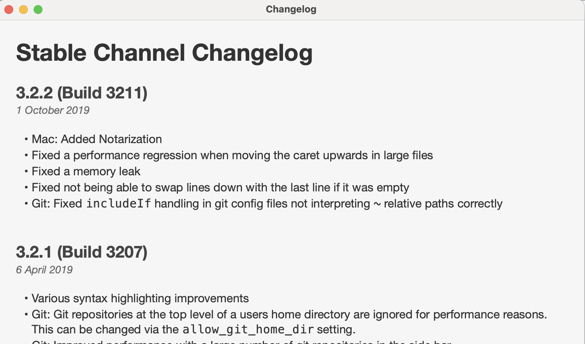

# commit 生成 changelog

我们在使用 app 时，如果你有注意，就会发现在版本升级时，有些 app 会展示给你 changlog，用来标示每个版本更新了哪些功能。

例如，像这样 sublime text 的 changelog



这篇文就来看看怎样生成这样的 changelog，生成 changelog 依赖于 commit 信息，所以要想自动生成 changelog，首先要规范好 commit 信息。

## commit 信息校验

git 提供了 hook 用来在进行 git 操作时进行校验，当然，这里我们选择用插件

需要先安装 **husky** 和 **commitlint** 两个插件

```shell
yarn add -D husky commitlint
```

在 package.json 中，新增 husky 属性，对 commit 提交的信息用 commitlint 插件进行校验

```json
{
  "husky": {
    "hooks": {
      "commit-msg": "commitlint -E HUSKY_GIT_PARAMS"
    }
  }
}
```

使用 commitlint 需要新建 **commitlint.config.js** 文件，进行配置，具体配置可以看[文档](https://commitlint.js.org/#/reference-configuration)，这里我们选择常规配置，常规配置一般就够用了。需要先安装 **@commitlint/config-conventional** 插件，再配置 commitlint.config.js

```js
module.exports = {
  extends: ["@commitlint/config-conventional"],
}
```

就大功告成了，如果不出意外的话，每次 commit 之前都会进行校验

## commit 信息如何写

一个符合规范的 commit 信息应该包括三个部分 header（必填）、body(可忽略)、footer (可忽略)，具体信息可查看[文档](https://www.conventionalcommits.org/en/v1.0.0/)

```git
<type, 必填>(<scope，可忽略>): subject(必填)
```

type 包含以下几种

| type     | 说明                                              | 是否出现在 changelog 中 |
| -------- | ------------------------------------------------- | :---------------------: |
| feat     | 新功能(feature)                                   |           会            |
| fix      | 修复 bug                                          |           会            |
| docs     | 文档                                              |        自行决定         |
| style    | 格式（不影响代码运行的变动）                      |        自行决定         |
| refactor | 重构（即不是新增功能，也不是修改 bug 的代码变动） |        自行决定         |
| test     | 增加测试                                          |        自行决定         |
| chore    | 构建过程或辅助工具的变动                          |        自行决定         |

一个最简短的 commit 例子如下

```git
git commit -m 'feat: 新增人员搜索功能'
```

如果你想写的具体点，那可以使用下面的格式

```bash
<type>[optional scope]: <description>

[optional body]

[optional footer(s)]
```

## 生成 changelog

生成 changelog.md 我们选择的是 **conventional-changelog-cli**

安装完毕后，我们在 package.json 中新增一行 script

```json
{
  "script": {
    "changelog": "conventional-changelog -p angular -i CHANGELOG.md -s"
  }
}
```

执行这条 script，就会将符合规范的 commit 提交信息生成 changelog.md 文件。

如果是第一次生成 changelog 文件，可以执行下面这条命令将所有的 commit 都生成在文件里。

```bash
conventional-changelog -p angular -i CHANGELOG.md -s -r 0
```

那么上面的这条 script，只会将当前的 commit 跟最近一次 tag 的提交做对比，列出两者之间的 diff

所以，在 commit 之后，如果这是一次版本更新的话，要及时将这次 commit 打上 tag，

列出所有 tag

```git
git tag
```

新建 tag

```git
git tag -a v1.2.0 -m '版本信息'
```

也可以直接使用 npm version 来更新版本 **「推荐」**

```git
npm version 1.2.0
```

这条指令可以直接将 package.json 中的 version 更改为 1.2.0，同时也会生成同名的 tag，还是帮你提交 commit，默认 commit 信息也为版本号，你也可以直接指定 commit 信息

```git
npm version 1.2.0 -m '说点啥呢'
```

将 tag 信息推到 远程，别忘了顺便把 commit 提交上去。

```git
git push --tag
git push
```

注意：保持 tag 号跟 package.json 中的 version 一致，就不会产生歧义。
